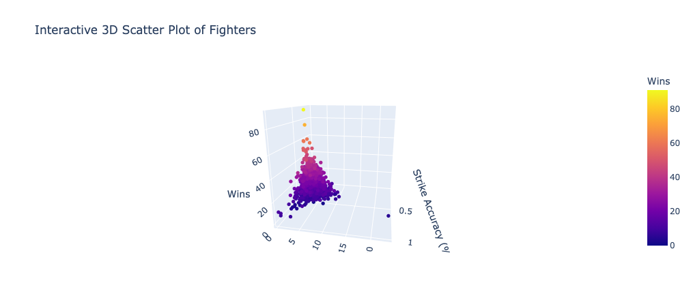
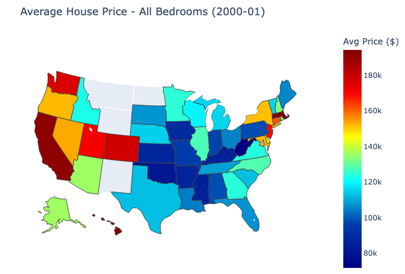

# Data Visualization Portfolio

## About Me
Use this space to introduce yourself to an audience (think about your target audience). Tell them about who you are, your skills, your strengths, your interests, and career aspirations.

Welcome to my data visualization portfolio! Here, you'll find a collection of projects showcasing my skills in data analysis and visualization. I am passionate about turning data into meaningful insights and compelling visuals.

<!--Include links to documents or sites that may be useful to your target audience: website, LinkedIn, your cv/resume, github, a community you contribute to, etc -->

To learn more about me, you can visit my [Linked In](https://www.linkedin.com/in/raymon-reyes-b51746276/), my [github](https://github.com/Stingray148), or read my [CV](Images/CV.pdf).

---

## The Remix

<table align="right | left" style = "border-collapse: collapse; border: none;">
    <tr style = "border: none;">
        <td style="padding: 10px; width:25%; border: none;"> 
            
        </td>
        <td style="padding:10px; width:75%; border: none;" valign = "top">
            

            In this project I found a graph in the wild that I thought I could improve on. I chose a graph that compared the strike attempts and accuracy of different UFC fighters. I then started to  remix the graph in my own creative way. I created a 3-D graph that compared strikes,accuracy, and wins of each fighter. I have provided the code and the data to be able to replicate that graph. It's also interactive making it cool and fun to play with. <a href="./Project 1/README.md">Learn more</a>
              
            <i>Tools used: Python, Pandas, Plotly, Canva</i>
            

        </td>
    </tr> 
</table>

## Internet Accessibility Infographic

<table align="right | left" style = "border-collapse: collapse; border: none;">
    <tr style = "border: none;">
        <td style="padding: 10px; width:25%; border: none;"> 
            
        </td>
        <td style="padding:10px; width:75%; border: none;" valign = "top">
            

            In this project I developed an infographic. I wanted to bring attention to internet accessibility because we live in an increasingly technological world but there are many places where most people have little to no access to the internet at all and that can affect things like education and income. First I got my data from the world development indicators then produced the initial graph. I then worked in inkscape and canva to make it look more artistic and add some additional text.<a href="./Project 2/README.md">Learn more</a>
              
            <i>Tools used: Python, Pandas, Matplotlib</i>
            

        </td>
    </tr> 
</table>

## U.S Home Price Dashboard
<table align="right | left" style = "border-collapse: collapse; border: none;">
    <tr style = "border: none;">
        <td style="padding: 10px; width:25%; border: none;"> 
            
        </td>
        <td style="padding:10px; width:75%; border: none;" valign = "top">
            

           In this project I created an interactive dashboard. I wanted to focus on housing prices in the United States. I got data from zillow and was able to make a dashboard that showed average housing prices over the last 25 years and was also able to add tabs that would show average prices for different size homes depending on how many bedrooms the home had.<a href="./Project 3/README.md">Learn more</a>
              
            <i>Tools used: Canva, Recraft</i>
            

        </td>
    </tr> 
</table>